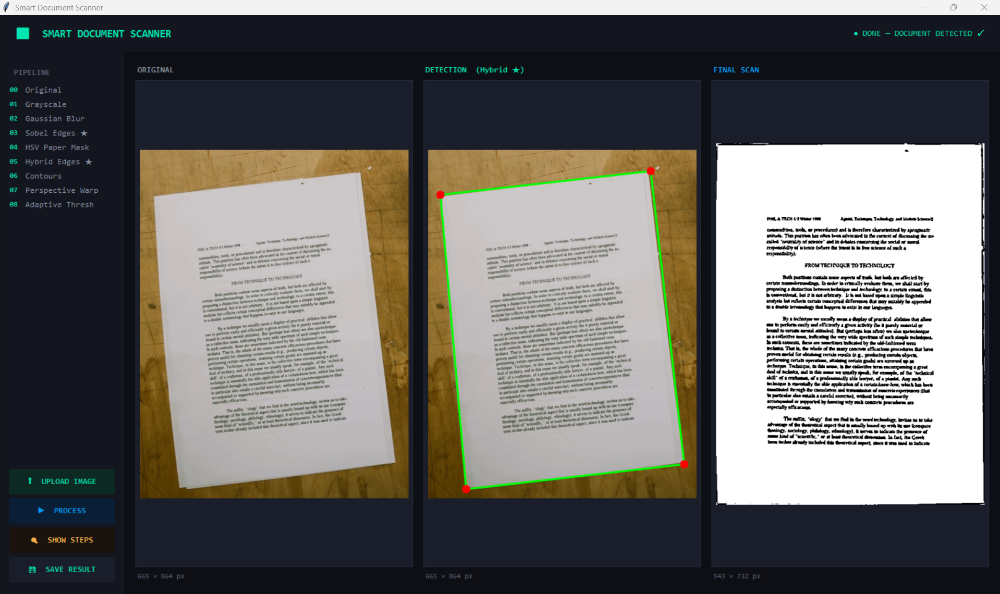

# Smart Document Scanner 

A high-performance document scanning application built with **Python** and **OpenCV**. This project features a custom-engineered **Hybrid Edge Detection Pipeline** designed to isolate documents from complex backgrounds with high precision.



## Key Technical Features
* **Custom Sobel Implementation:** Unlike standard solutions, the core edge detection (Sobel Filter) is implemented **from scratch** using NumPy to handle mathematical convolutions and image gradients manually.
* **Hybrid Detection Pipeline:** Combines **Sobel Gradients** with **HSV Color Masking** to filter out background noise and focus strictly on the document area.
* **Perspective Transformation:** Automatically detects the four corners of a document and applies a **4-point transform** to generate a top-down, "scanned" view.
* **Adaptive Processing:** Utilizes **Fast Non-Local Means Denoising** and **Adaptive Thresholding** to produce crisp, high-contrast outputs suitable for printing.
* **Advanced GUI:** A modern, dark-themed dashboard built with **Tkinter**, featuring a multi-threaded architecture to ensure smooth UI performance during processing.

## Tech Stack
* **Language:** Python
* **Libraries:** OpenCV, NumPy, Pillow (PIL)
* **UI:** Tkinter (Custom Dark Theme)
* **Algorithms:** Sobel Filter (Manual), Perspective Warp, Adaptive Gaussian Thresholding.

## Pipeline Visualization
The application includes a **Pipeline Viewer** that allows you to see the image at every stage of transformation:
1. Grayscale -> 2. Gaussian Blur -> 3. **Sobel (From Scratch)** -> 4. HSV Masking -> 5. Hybrid Combination -> 6. Contour Detection -> 7. Perspective Warp -> 8. Final Adaptive Threshold.


## Getting Started
1. **Clone the repo:**
   ```bash
   git clone [https://github.com/MariamAshraf25/Smart-Document-Scanner.git](https://github.com/MariamAshraf25/Smart-Document-Scanner.git)

## Author
**Mariam Ashraf  **
*Computer Engineering Student - Faculty of Engineering - Capital University (Formerly Helwan)*
[LinkedIn Profile](https://www.linkedin.com/in/mariam-ashraf-84415b2b8)